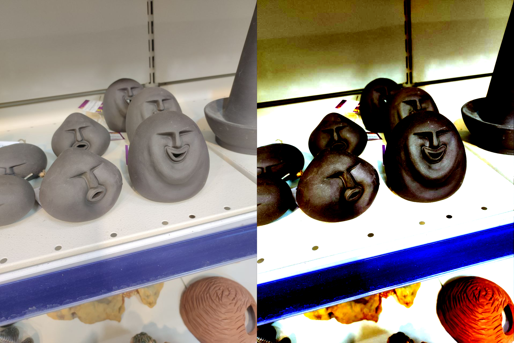
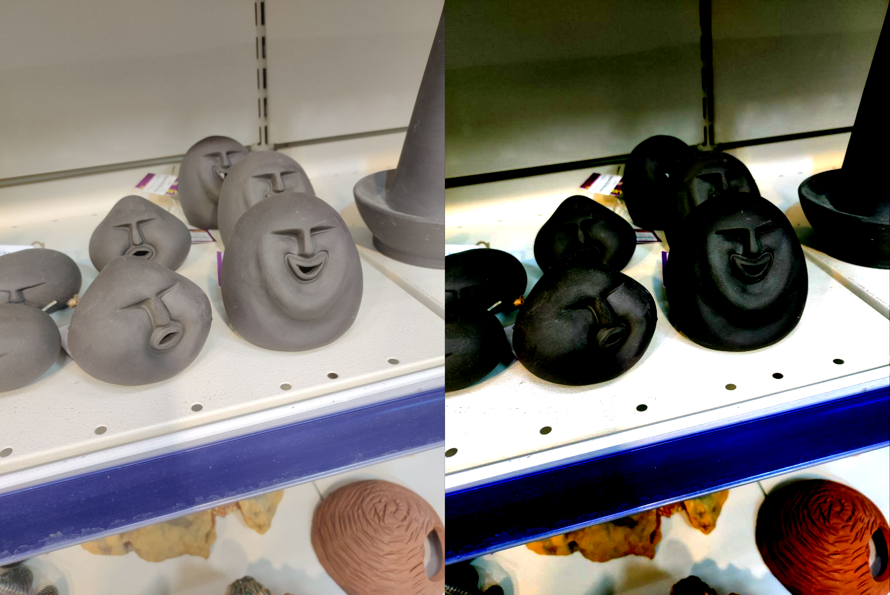

# ЛР3 - автоконтраст

## Описание
Консольное приложение, автоконтрастирующее входное изображение по заданным квантилям черного и белого. Имеет режимы поканального и совместного контрастирования.
- При *поканальном* контрастировании пороговые значения белого и черного для каждого канала подбираются индвивидуально;
- При *совместном* контрастировании выбирается минимальное из всех каналов пороговое значение черного и максимальное из всех каналов пороговое значение белого;

Итоговое изображение представляет из себя горизонтально конкатенированные исходное и автоконтрастированное изображение и сохраняется в директорию с исполняемым файлом.

## Входные параметры приложения
- ***qw*** - квантиль черного, умолчательно *0,3*;
- ***qb*** - квантиль черного, умолчательно *0,3*;
- ***m*** или ***mode*** - режим работы, где 0 - поканальный контраст, 1 - совместный; умолчательное значение *1*;

## Примеры работы приложения
Для значений квантилей: *0.05* для белого и *0.05* для черного

Для значений квантилей: *0.3* для белого и *0.3* для черного

Для значений квантилей: *0.15* для белого и *0.3* для черного и режим работы 0
